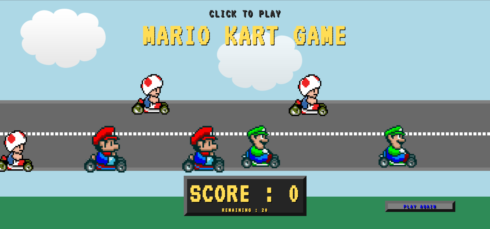
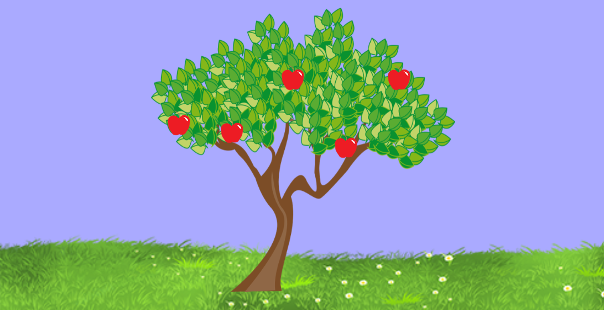
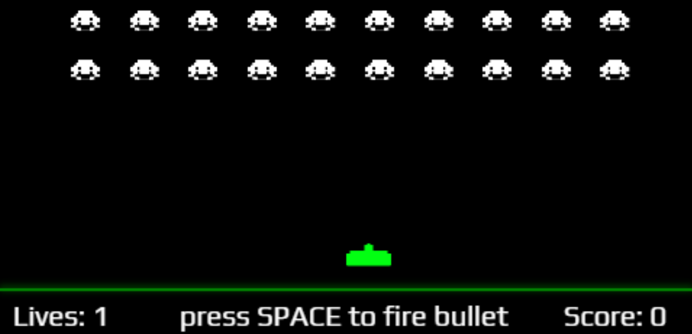
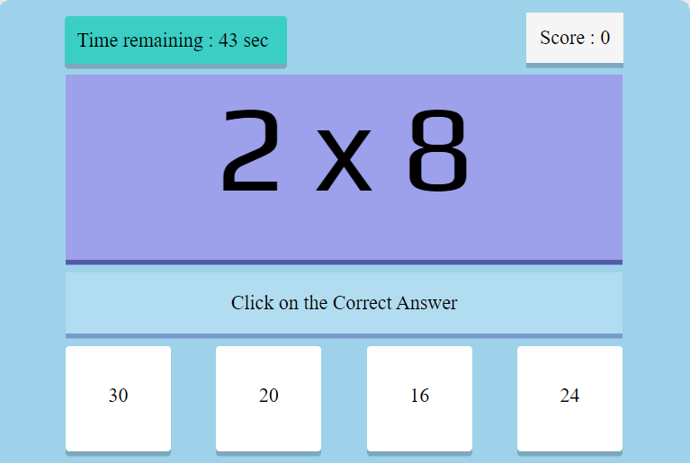

# simple-game-portal
 Create a Basic and simple game portal structure using HTML, style it using CSS and make it work using JavaScript.

<h2>Mario kart game</h2>

 
<h2>Apple collector</h2>

 
<h2>Space invaders</h2>

 
<h2>mathematics game</h2>

